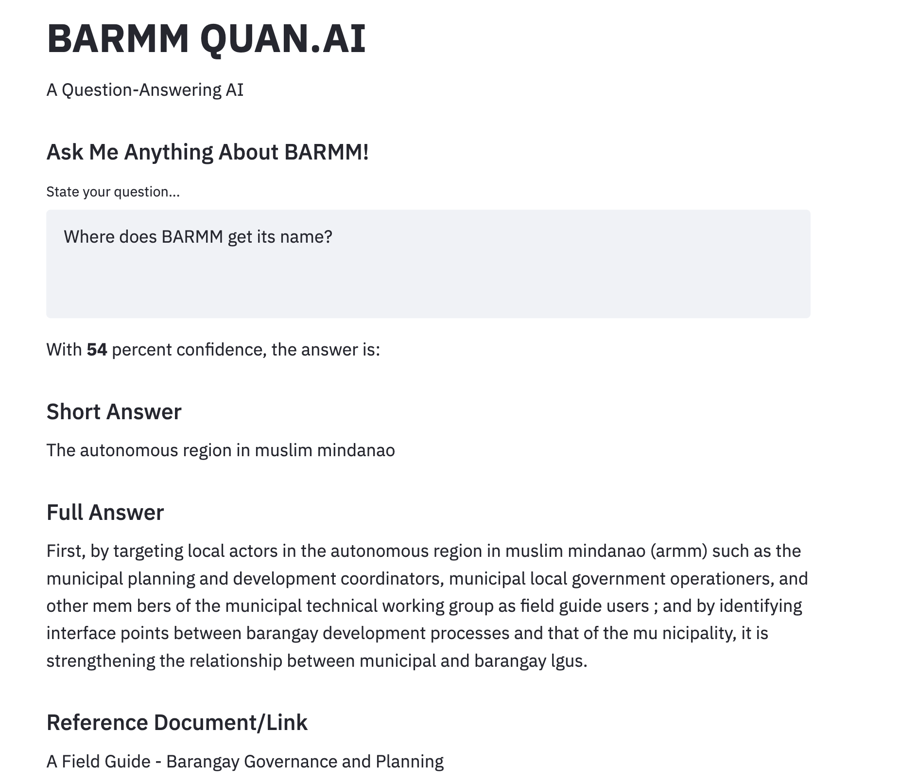

# BARMM QUAN.AI
### Question-Answering using BERT
Simple web application for question-answering using BERT. Here's a [link](https://drive.google.com/drive/folders/1gxXUrlT48MMFRPjf90fXOPFoDOW6Yxmc?usp=sharing) to pitch presentation, and demo video.

### Data Preprocessing
I had to scrape data online and process hundreds of pages per PDF for hundreds of pdfs. Here's the [script](https://colab.research.google.com/drive/1y_H_E97BRBq7NnXO_2vpCi7zzHGCISTx?usp=sharing) to do it.

# Sample Web Application

